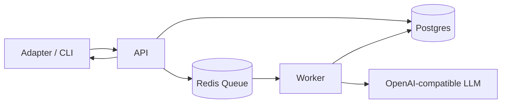

# Project Memory

[](https://github.com/yul761/ProjectMemory/actions/workflows/ci.yml)
[](https://github.com/yul761/ProjectMemory/actions/workflows/integration-smoke.yml)
[](https://opensource.org/licenses/MIT)
[](https://github.com/yul761/ProjectMemory/releases)

An open-source **research-grade long-term memory engine**. It provides primitives to ingest events, produce layered digests, retrieve memory, and (optionally) answer questions grounded in that memory.

This is **not** a consumer assistant app. You bring your own infrastructure and secrets via environment variables. The primary goal is reproducible evaluation of memory systems and digest reliability.

## Quickstart in 5 minutes

1) **Start infra**
```bash
cd project-memory
docker-compose up -d
```
This starts Postgres + Redis only.

2) **Install deps**
```bash
pnpm install
```

3) **Set env**
```bash
cp .env.example .env
```
Apps will auto-load the repo root `.env` on startup.
You can override per app by creating `apps/<app>/.env` (for example `apps/worker/.env`).

4) **DB migrate + seed**
```bash
pnpm db:generate
pnpm db:migrate
pnpm seed
```

5) **Run services**
```bash
pnpm dev:api
pnpm dev:worker
pnpm dev:telegram
```

Optional CLI:
```bash
pnpm dev:cli -- scopes
```

No-LLM smoke test:
```bash
./scripts/smoke-no-llm.sh
```

LLM smoke test:
```bash
FEATURE_LLM=true OPENAI_API_KEY=... ./scripts/smoke-llm.sh
```

Reminder smoke test:
```bash
./scripts/smoke-reminders.sh
```

All smoke tests:
```bash
pnpm smoke
```

Core unit tests (digest control layer):
```bash
pnpm --filter @project-memory/core test
```

Benchmark (performance + reliability score):
```bash
pnpm benchmark
```

## Config matrix

Required for all:
- `DATABASE_URL`, `REDIS_URL`

API (`apps/api`):
- `PORT`, `LOCAL_USER_TOKEN` (dev)
- Optional LLM: `FEATURE_LLM=true` + `OPENAI_*`

Worker (`apps/worker`):
- `FEATURE_LLM=true` + `OPENAI_*` for digests
- Optional Telegram reminder delivery: `FEATURE_TELEGRAM=true` + `TELEGRAM_BOT_TOKEN`
- Digest control vars:
  - `DIGEST_EVENT_BUDGET_TOTAL`, `DIGEST_EVENT_BUDGET_DOCS`, `DIGEST_EVENT_BUDGET_STREAM`
  - `DIGEST_NOVELTY_THRESHOLD`, `DIGEST_MAX_RETRIES`
  - `DIGEST_USE_LLM_CLASSIFIER`, `DIGEST_DEBUG`, `DIGEST_REBUILD_CHUNK_SIZE`
  - `DIGEST_CONCURRENCY` (default 2)
- Reminder tuning:
  - `REMINDER_CONCURRENCY` (default 1)
  - `REMINDER_BATCH_SIZE` (default 50)
  - `REMINDER_MAX_BATCHES` (default 4)

Telegram adapter (`apps/adapter-telegram`):
- `FEATURE_TELEGRAM=true`
- `TELEGRAM_BOT_TOKEN`, `PUBLIC_BASE_URL`, `TELEGRAM_WEBHOOK_PATH`, `API_BASE_URL`
- `ADAPTER_PORT` (optional)

CLI (`apps/cli`):
- `API_BASE_URL`

## Telegram webhook setup

Set `PUBLIC_BASE_URL` and call the adapter:
```bash
curl -X POST "http://localhost:3001/telegram/webhook/set"
```

## FEATURE_LLM
Set `FEATURE_LLM=true` and provide `OPENAI_API_KEY` to enable `/memory/answer` and digest jobs. If disabled, the API returns a clear error and worker jobs fail fast.

## Digest Control Layer
Digest is processed as a controlled pipeline (not a single LLM call):
- Event selection with dedupe and per-type budgets
- Delta detection with novelty threshold
- Protected deterministic state merge for stable facts
- LLM stage with strict JSON schema
- Consistency checks + retry (`DIGEST_MAX_RETRIES`)
- Rebuild/backfill endpoint: `POST /memory/digest/rebuild`

## Workflow Diagram


## How It Works (Technical)
- API validates input with shared Zod contracts and scopes all requests by user identity.
- Core engine (`packages/core`) performs selection/delta/state/consistency logic.
- Worker executes digest and rebuild jobs asynchronously via BullMQ.
- Digests are stored as first-class records, with optional `rebuildGroupId` for backfills.
- Adapters call API only (no direct database coupling).

## Research Benchmarks
Use the built-in benchmark runner to generate reproducible metrics and a score report:

- Ingest throughput + p95 latency
- Retrieve semantic/strict hit-rate + p95 latency
- Digest success/consistency/latency (when `FEATURE_LLM=true`)
- Reminder due-to-sent delay

Run:
```bash
pnpm benchmark
```

Optional profile:
```bash
BENCH_PROFILE=stress pnpm benchmark
```

Reports are generated in `benchmark-results/` as JSON + Markdown.

Reproducible run example:
```bash
BENCH_SEED=42 BENCH_FIXTURE=benchmark-fixtures/basic.json pnpm benchmark
```

## Research Artifacts
- Research overview: `docs/research-overview.md`
- Evaluation protocol: `docs/evaluation-protocol.md`
- Research questions: `docs/research-questions.md`
- Report template: `docs/research-report-template.md`
- Ablation results (2026-02-08): `docs/ablation-results-2026-02-08.md`

## Troubleshooting
- Prisma runs from `packages/db`, so copy `.env` to `packages/db/.env` before `pnpm db:migrate`.
- If API or worker says `FEATURE_LLM disabled` but `.env` is set, restart the process after updating `.env`.
- Ensure Postgres port mapping matches `DATABASE_URL` (e.g. `5433:5432` in `docker-compose.yml`).
- Reminder smoke test depends on the worker’s 60s scheduler; keep the worker running and allow ~1–2 minutes.
- Digest and rebuild endpoints require `FEATURE_LLM=true`; otherwise API returns an actionable 400 message.

## Repo structure
- `apps/api` NestJS REST API
- `apps/worker` BullMQ workers
- `apps/adapter-telegram` Telegram reference adapter
- `apps/cli` Developer CLI
- `packages/core` domain services + pipelines
- `packages/contracts` Zod schemas + shared enums
- `packages/prompts` prompt templates
- `packages/db` Prisma schema + client

See `docs/api.md` for endpoint details.
See `docs/glossary.md` for term definitions.
See `docs/technical-overview.md` for architecture and pipeline internals.
See `docs/benchmarking.md` for benchmark methodology and scoring.
See `docs/release.md` for release/versioning workflow.
See `docs/release-v0.1.0.md` for the initial release notes draft.
See `ROADMAP.md` for planned milestones.

## OSS Project Hygiene
- Contribution guide: `CONTRIBUTING.md`
- Code of conduct: `CODE_OF_CONDUCT.md`
- Security policy: `SECURITY.md`
- Changelog: `CHANGELOG.md`
- CI workflow: `.github/workflows/ci.yml`

## Quality Gates
- `pnpm format:check` for formatting checks
- `pnpm lint` for strict TypeScript checks across workspaces
- `pnpm build` for full workspace compilation
- `pnpm --filter @project-memory/core test` for core unit tests
- `.github/workflows/integration-smoke.yml` runs API + worker smoke tests (no LLM)
