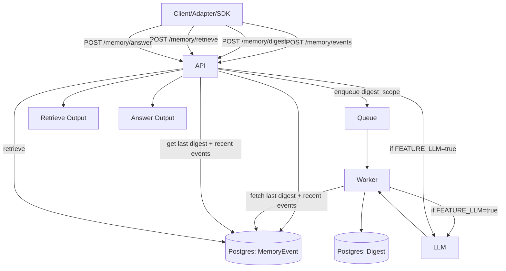

# Project Memory Philosophy

Project Memory is a **long-term memory engine**, not a personal assistant. It provides primitives for ingesting events, producing layered digests, retrieving memory, and (optionally) generating answers grounded in that memory.

Principles:
- **Engine, not app**: no UI or hosted service. You own infra and secrets.
- **Layered memory**: each digest builds on the last digest plus recent events.
- **Two memory types**: stream (append-only) and document (upsert by key).
- **Adapters are references**: Telegram + CLI show how to integrate.
- **Replaceable intelligence**: LLM is optional and swappable.
- **Digest control layer**: selection, deltas, protected merge, consistency checks, and retry.

## Digest Control Layer

Digest generation is a controlled pipeline:
1. Select events (dedupe + budget + latest docs)
2. Detect deltas (novelty threshold, always keep decision/constraint)
3. Protect state (conservative deterministic merge)
4. Generate digest via LLM with structured output
5. Run consistency checks and retry when needed
6. Support rebuild/backfill when a digest chain drifts

## Memory Flow (High-Level)

For implementation details of each stage, see `docs/technical-overview.md`.
