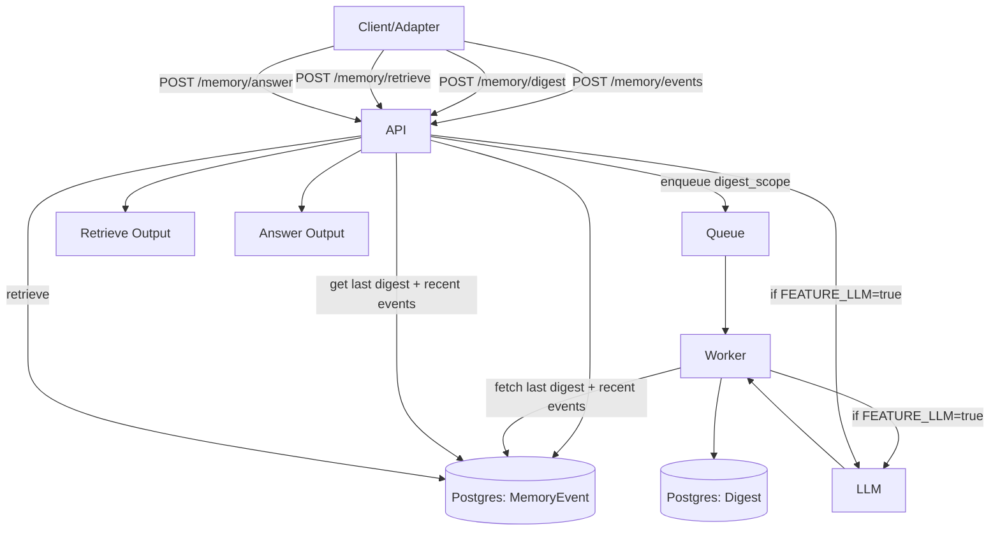

# StateCore Philosophy

StateCore is a **long-term memory engine**, not a personal assistant. It provides primitives for ingesting events, producing layered digests, retrieving memory, and (optionally) generating answers grounded in that memory.

Principles:
- **Engine, not app**: no UI or hosted service. You own infra and secrets.
- **Layered memory**: each digest builds on the last digest plus recent events.
- **Two memory types**: stream (append-only) and document (upsert by key).
- **Integrations call the API**: external clients call the HTTP API and never touch the database directly.
- **Replaceable intelligence**: LLM is optional and swappable.
- **Replaceable ontology**: what a facet *means* comes from a pack, not from the engine. The core stores, protects, supersedes and retrieves without knowing the domain.
- **Digest control layer**: selection, deltas, protected merge, consistency checks, and retry.
- **Auditable, not merely stored**: every fact keeps its evidence and its version chain, a fact that leaves the active set is retired rather than deleted, and every discard is recorded with a reason. Losing information is survivable; losing it silently is not.

## Why Auditability Is the Centre

Storing raw context commits the system to nothing, so there is nothing to audit.
Abstracting events into state is the point at which the system starts making
claims — and the abstraction step is where errors enter. **Holding state creates
the need for an audit, and the audit is what makes holding state trustworthy.**
They arrive together, which is why this is one design rather than a feature
bolted onto one.

It is also not the axis public memory benchmarks measure. Exhaustive
needle-in-haystack recall says nothing about contradiction resolution or whether
state stays stable over time. `docs/longmemeval.md` reports where the engine wins,
where it loses, and what the score does not cover.

## Digest Control Layer

Digest generation is a controlled pipeline:
1. Select events (dedupe + budget + latest docs)
2. Detect deltas (novelty threshold, always keep decision/constraint)
3. Protect state (conservative deterministic merge)
4. Generate digest via LLM with structured output
5. Run consistency checks and retry when needed
6. Support rebuild/backfill when a digest chain drifts

## Memory Flow (High-Level)

```mermaid
flowchart TD
  A[Client/Adapter] -->|POST /memory/events| B[API]
  B --> C[(Postgres: MemoryEvent)]

  A -->|POST /memory/digest| B
  B -->|enqueue digest_scope| Q[Queue]
  Q --> W[Worker]
  W -->|fetch last digest + recent events| C
  W -->|if FEATURE_LLM=true| L[LLM]
  L --> W
  W --> D[(Postgres: Digest)]

  A -->|POST /memory/retrieve| B
  B -->|get last digest + recent events| C
  B --> R[Retrieve Output]

  A -->|POST /memory/answer| B
  B -->|retrieve| C
  B -->|if FEATURE_LLM=true| L
  B --> O[Answer Output]
```

For implementation details of each stage, see `docs/technical-overview.md`.
