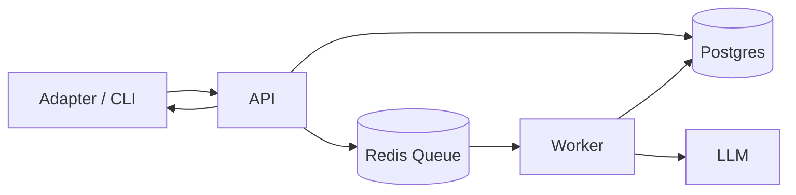
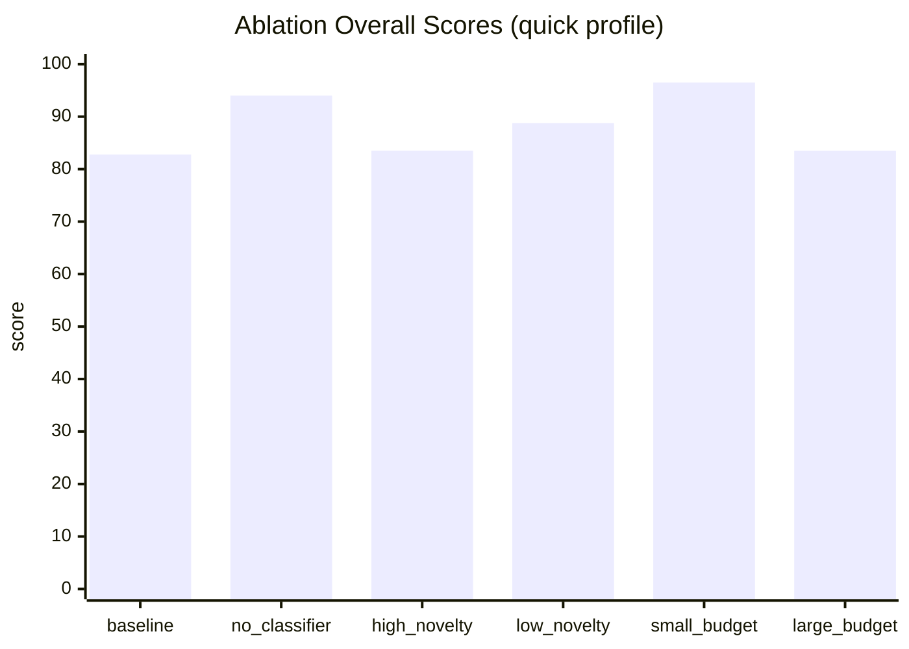

# Project Memory: A Research-Oriented Long-Term Memory Engine

## 1. Abstract

This article presents Project Memory, a research-grade long-term memory engine designed to study layered digests, consistency constraints, and retrieval quality under controlled workloads. We describe the system architecture, the digest control pipeline, and a reproducible benchmarking methodology. We then report baseline and ablation results that illuminate the trade-offs between event budget, novelty thresholds, and optional classification. The goal is not to claim state-of-the-art performance, but to provide a transparent, reproducible baseline for future work on long-term memory systems.

## 2. Introduction

Long-term memory in assistant systems requires a balance between fidelity, cost, and stability. Naively appending the entire interaction history is infeasible: context windows are limited, latency rises with input size, and unrestricted accumulation increases the risk of contradictory or stale information. At the same time, aggressive compression can erase the specific, time‑sensitive details that matter for decision‑making. The central challenge is therefore not only how to store more data, but how to preserve the *right* data and present it reliably under constrained budgets.

Project Memory approaches this problem by generating *layered digests* from recent events with explicit, deterministic constraints. Rather than treating summarization as an opaque LLM operation, the system enforces a structured pipeline that selects evidence, computes novelty, merges protected state, and then validates output against consistency rules. This design enables attribution of errors to specific stages and supports controlled ablations that isolate each component’s contribution.

This work sits at the intersection of two research lines. Retrieval‑augmented language modeling (e.g., RAG, REALM, RETRO) shows that explicit external memory can improve knowledge‑intensive tasks while reducing reliance on model parameters. Memory hierarchy approaches (e.g., MemGPT) focus on managing long‑term context by paging and prioritizing memory fragments. Project Memory differs in emphasis: it targets *digest consistency* and *reproducibility* under a fixed evaluation protocol, enabling careful measurement of trade‑offs between recall, stability, and cost.

The remainder of this article presents the system design, formalizes the evaluation protocol, and reports baseline and ablation results. Our goal is not to optimize a single metric, but to provide a rigorous, reproducible baseline for future research on long‑term memory pipelines.

This article documents the system as a research artifact. It summarizes its design principles, evaluation protocol, and empirical results collected under fixed fixtures. The intent is to offer a baseline and a methodology rather than a final answer.

## 3. System Design

Project Memory is organized as a backend engine with four primary subsystems:

1. **Ingest**: Events enter as either append-only streams or keyed documents (upserts).
2. **Digest**: Events are compressed into layered summaries via a controlled pipeline.
3. **Retrieve**: A query returns the latest digest plus a ranked slice of events.
4. **Answer (optional)**: An LLM responds using retrieved memory (disabled by default).

Key architectural choices include:
- **Separation of concerns**: core logic in `packages/core`, transport in API/Worker, enabling evaluation independent of deployment details.
- **Reproducibility**: deterministic selection rules, explicit budgets, and persisted digest state snapshots to reduce drift across runs.
- **Observability**: stage‑level metrics and failure reasons to support error attribution.

From a research perspective, this separation makes it possible to compare algorithmic variants without conflating system or infrastructure factors. The system’s primary outputs (digest summary, changes, next steps) are deterministic *given* the evidence and model settings, and the evaluation harness records configuration, environment, and commit metadata for reproducibility.

### Figure 1. High-Level Flow



## 4. Digest Control Pipeline

The digest pipeline is intentionally not a single LLM call. It is a five-stage, constrained flow:

1. **Event Selection**  
   - Deduplicate near-identical events.  
   - Always include the latest document per key.  
   - Budget control across total events, docs, and streams.

2. **Delta Detection**  
   - Compute novelty against the prior digest.  
   - Always keep decision/constraint events.  
   - Drop low-novelty events below threshold.

3. **Protected State Merge**  
   - Deterministic merge into `DigestState`.  
   - Stabilize goals, constraints, decisions, and todos.

4. **LLM Generation**  
   - Structured JSON output.  
   - Optional classification stage.

5. **Consistency Check + Retry**  
   - Enforce constraints on length, bullets, and contradictions.  
   - Retry when failures are detected.

Persisted digest state snapshots enable deterministic replay and reduce drift across runs. This is crucial for research settings: without snapshots, the system must reconstruct state from prior textual digests, introducing ambiguity and reducing experimental repeatability.

### Figure 2. Digest Control Pipeline

```mermaid
flowchart TD
  E[Recent events + last digest] --> S1[1) Event Selection]
  S1 --> S2[2) Delta Detection]
  S2 --> S3[3) Protected State Merge]
  S3 --> S4[4) LLM Digest Generation]
  S4 --> S5[5) Consistency Check]
  S5 -->|pass| OUT[Persist Digest + Snapshot]
  S5 -->|fail + retries| S4
```

## 5. Evaluation Protocol

Experiments follow a fixed, reproducible protocol designed to minimize confounds. Each run records the code commit, environment metadata, and a fully specified benchmark configuration. This ensures that reported outcomes can be reproduced, compared, and audited.

- **Environment capture**: commit hash, OS, CPU, and Node version are recorded.  
- **Fixed seeds**: `BENCH_SEED` is used to control noise content.  
- **Fixtures**: event and retrieval sets can be fixed via `BENCH_FIXTURE`.  
- **Reports**: results are stored as JSON and Markdown with config metadata.

This yields a consistent baseline for evaluating changes and ablations. In particular, the combination of fixed seeds and fixtures enables attribution of performance changes to algorithmic differences rather than to stochastic variations in input composition.

### 5.1 Metrics

We report four categories of metrics:

- **Ingest**: throughput (events/s), p50/p95 latency, success rate.  
- **Retrieve**: semantic hit rate (aliases), strict hit rate (exact match), p50/p95 latency.  
- **Digest**: success rate, consistency pass rate, average end‑to‑end latency.  
- **Reminder**: success rate, due‑to‑sent latency.

The overall score is a weighted combination of these components. When `FEATURE_LLM=false`, digest scoring is skipped and weights are adjusted accordingly.

## 6. Baseline Results

Using `benchmark-fixtures/basic.json` (seed 42, quick profile), the baseline report shows:

- **Overall**: 88.75 / 100  
- **Ingest**: 100 (p95 84.78 ms, 102.5 events/s)  
- **Retrieve**: 100 (hit rate 1.0, p95 26.62 ms)  
- **Digest**: 62.5 (consistency pass 0.5, avg latency ~52s)  
- **Reminder**: 100 (delay ~35s)

While ingest and retrieve are strong under this fixture, the digest component exhibits both latency and consistency variance, motivating ablation experiments. Digest latency is especially sensitive to LLM generation and retry behavior, underscoring the need for explicit constraints and empirical measurement.

### 6.1 Baseline Interpretation

The baseline indicates that deterministic selection and retrieval heuristics can achieve stable performance under a fixed fixture. However, the digest component remains the most volatile: it depends on LLM behavior and is constrained by strict consistency rules. These results suggest that digest quality is a primary bottleneck for system stability.

## 7. Ablation Study

We ran controlled ablations that change one variable at a time, holding the fixture, seed, and profile constant:

- **no_classifier**: disables LLM classification  
- **high_novelty / low_novelty**: changes novelty thresholds  
- **small_budget / large_budget**: changes event budgets

Key results (overall score):

- **small_budget**: 96.49 (best)  
- **no_classifier**: 94.00  
- **low_novelty**: 88.75  
- **baseline**: 82.78  
- **high_novelty**: 83.50  
- **large_budget**: 83.49

Interpretation:

- Smaller budgets reduce inconsistency and improve overall scores.  
- The classifier did not help under the fixed fixture; disabling it improved outcomes.  
- High novelty thresholds filtered too aggressively and degraded digest quality.  
- Large budgets increased evidence volume and harmed digest consistency.

These trends are consistent with a “minimal evidence” principle: narrower evidence sets reduce contradiction risk and stabilize summaries. In practice, this suggests that aggressive evidence pruning may improve stability more than increased model complexity (e.g., classifier use).

### Figure 3. Ablation Summary (Overall Score)



## 8. Discussion and Future Work

The results suggest that in controlled settings, digest quality is more sensitive to event volume and novelty filtering than to classification complexity. However, these outcomes are fixture‑dependent. The next step is cross‑fixture validation and multi‑profile testing to ensure robustness.

Planned extensions:

- Evaluate `decision-heavy` and `noise-heavy` fixtures.  
- Expand novelty thresholds into finer-grained sweeps.  
- Compare snapshot-enabled vs snapshot-disabled runs.  
- Introduce multi-model evaluation (different LLM providers or settings).

Project Memory is best viewed as a research testbed: a controlled, reproducible environment for exploring the design space of long‑term memory systems. The system is intentionally conservative and transparent, prioritizing reproducibility over maximum raw performance.

## 9. Related Work

Retrieval‑augmented approaches (RAG, REALM, RETRO) demonstrate that an external memory can improve accuracy on knowledge‑intensive tasks, effectively trading off parametric storage for retrieval quality. Memory hierarchy strategies (e.g., MemGPT) focus on managing limited context windows by paging and prioritizing relevant fragments. Project Memory complements these lines by providing a digest‑centric pipeline with explicit constraints and reproducible evaluation, enabling controlled tests of how summarization and selection policies affect stability over time.

## 10. Practical Implications for Market Products

Although Project Memory is positioned as a research artifact rather than a commercial product, its results have implications for existing memory‑enabled systems in the market. Many production assistants and enterprise copilots rely on a mixture of retrieval and summarization. The ablation findings suggest that **how much evidence is admitted** and **how aggressively novelty is filtered** can have a larger impact on stability than additional classification or reranking layers.

### 10.1 Implications for Retrieval‑First Systems

Retrieval‑first products often optimize for recall, bringing in many candidate snippets before reranking. Our results indicate that overly large evidence sets can degrade digest consistency. For production systems, this supports tighter evidence budgets and stricter selection heuristics, particularly for summarization stages. In practice, a smaller, higher‑precision evidence set may yield more stable, user‑trustworthy summaries even if recall decreases slightly.

### 10.2 Implications for Summary‑Driven Memory

Some products maintain “memory summaries” that are periodically refreshed. The ablation results suggest that **smaller budgets and moderate novelty thresholds** improve stability, implying that summary refreshes should be conservative rather than exhaustive. This can reduce drift and contradiction risk, especially for user preferences or long‑lived facts.

### 10.3 How This Research Helps Product Teams

The research contributes three actionable levers:

1. **Budget tuning**: Evidence budget is a dominant control knob. Teams can apply budget sweeps (small/medium/large) to find a stable operating point.  
2. **Novelty thresholds**: High thresholds can remove important context; moderate values can improve stability while controlling noise.  
3. **Classifier necessity**: Optional classifiers may not always help; disabling them can reduce variance on smaller workloads.

These levers are measurable, and the evaluation protocol makes it possible to test them under controlled fixtures before deploying to production workloads.

### 10.4 Comparative Framing

From a market comparison perspective:
- Retrieval‑heavy systems may achieve high recall but can suffer instability when summarizing large evidence sets.  
- Digest‑centric systems prioritize consistency and cost predictability, at the expense of fine‑grained recall.  
- Hybrid systems can use this research to determine *where* to apply summarization (e.g., on a curated subset) and *how much* evidence to include.

In short, the research does not argue for a single “best” product architecture. Instead, it provides reproducible evidence that **evidence volume and novelty thresholds are primary determinants of stability**, and these parameters can be tuned to meet product goals such as trust, latency, and cost.

### 10.5 Limitations and Practical Constraints

There are several important limitations to note. First, the evaluation relies on fixed fixtures and synthetic event streams; while this improves reproducibility, it may not capture the full complexity of real user data. Second, the digest pipeline depends on LLM behavior, which can vary across providers, models, and temperature settings. Third, the study emphasizes stability metrics (consistency, contradiction avoidance) more than end‑user satisfaction or task completion.

Practical deployment also introduces constraints not modeled here, including privacy requirements, data retention policies, and organizational security controls. These constraints can shape what memory is allowed to persist and how it is surfaced. The reported results should therefore be interpreted as **methodological guidance** rather than direct product prescriptions.

## 11. Results Tables

### 11.1 Baseline Metrics

| Metric | Value |
| --- | --- |
| Overall score | 88.75 |
| Ingest throughput | 102.5 events/s |
| Ingest p95 latency | 84.78 ms |
| Retrieve hit rate (semantic/strict) | 1.0 / 1.0 |
| Retrieve p95 latency | 26.62 ms |
| Digest success | 3/3 |
| Digest consistency pass rate | 0.5 |
| Digest avg latency | 52.27 s |
| Reminder delay | 35.19 s |

### 11.2 Ablation Comparison (Overall)

| Variant | Overall |
| --- | --- |
| baseline | 82.78 |
| no_classifier | 94.00 |
| high_novelty | 83.50 |
| low_novelty | 88.75 |
| small_budget | 96.49 |
| large_budget | 83.49 |

## 12. Threats to Validity

### 12.1 Internal Validity
The benchmark uses fixed fixtures and synthetic events, which reduces noise but may omit real‑world variability. Some outcomes could be driven by fixture‑specific artifacts rather than general properties of the pipeline.

### 12.2 External Validity
Results may not transfer to production workloads where input distributions, user behavior, and prompt constraints differ substantially. Additional validation on diverse datasets and tasks is required.

### 12.3 Construct Validity
The evaluation emphasizes stability (consistency, contradiction avoidance) over user utility. Alternative objectives—such as task completion, satisfaction, or correctness on real QA tasks—may yield different optimal configurations.

## 13. Reproducibility Statement

All experiments in this report are reproducible using the public repository. To replicate baseline and ablations:

```bash
BENCH_PROFILE=quick BENCH_TIMEOUT_MS=120000 BENCH_SEED=42 \
BENCH_FIXTURE=benchmark-fixtures/basic.json pnpm benchmark

BENCH_PROFILE=quick BENCH_TIMEOUT_MS=120000 BENCH_SEED=42 \
BENCH_FIXTURE=benchmark-fixtures/basic.json node scripts/benchmark/run-ablations.mjs
```

Record the commit hash, environment metadata, and the generated JSON/Markdown reports.

---

## Appendix: Reproducibility Pointers

- Benchmark runner: `scripts/benchmark/run-benchmark.mjs`  
- Ablation runner: `scripts/benchmark/run-ablations.mjs`  
- Baseline report: `benchmark-results/benchmark-2026-02-08T05-59-35-302Z.md`  
- Ablation summary: `benchmark-results/ablation-2026-02-08T06-34-38-713Z.md`  
- Evaluation protocol: `docs/evaluation-protocol.md`  

## References

- Lewis et al., 2020. Retrieval-Augmented Generation for Knowledge-Intensive NLP Tasks. NeurIPS 2020. `https://papers.nips.cc/paper_files/paper/2020/hash/6b493230205f780e1bc26945df7481e5-Abstract.html`
- Guu et al., 2020. REALM: Retrieval-Augmented Language Model Pre-Training. arXiv:2002.08909. `https://arxiv.org/abs/2002.08909`
- Borgeaud et al., 2021. Improving Language Models by Retrieving from Trillions of Tokens. arXiv:2112.04426. `https://arxiv.org/abs/2112.04426`
- Packer et al., 2023. MemGPT: Towards LLMs as Operating Systems. arXiv:2310.08560. `https://arxiv.org/abs/2310.08560`
