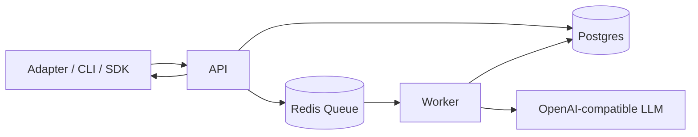

# Technical Overview

This document explains the backend architecture, technology choices, and the digest control workflow.

## Stack

- Runtime: Node.js 20+
- Language: TypeScript (strict)
- Monorepo: pnpm workspaces + Turborepo
- API: NestJS (`apps/api`)
- Queue/Jobs: BullMQ + Redis (`apps/worker`)
- Database: PostgreSQL + Prisma (`packages/db`)
- Contracts: Zod schemas (`packages/contracts`)
- Engine: Pure domain logic (`packages/core`)
- Prompt assets: `packages/prompts`
- Integrations: Telegram adapter + CLI + SDK client/react

## Why This Split

- `packages/core` keeps memory logic independent from transport/UI.
- `apps/api` handles auth, validation, and queueing.
- `apps/worker` runs asynchronous/expensive memory jobs.
- Adapters/SDKs only call API, never direct DB access.

## End-to-End Workflow



## Digest Control Pipeline

The digest pipeline is intentionally not a single LLM call.

```mermaid
flowchart TD
  E[Recent events + last digest] --> S1[1) Event Selection]
  S1 --> S2[2) Delta Detection]
  S2 --> S3[3) Protected State Merge]
  S3 --> S4[4) LLM Digest Generation]
  S4 --> S5[5) Consistency Check]
  S5 -->|pass| OUT[Persist Digest]
  S5 -->|fail + retries left| S4
  S5 -->|fail + no retries| ERR[Fail job with reason]
```

### 1) Event Selection

- Deduplicate near-identical consecutive stream events.
- Always include latest document version per key (within budget).
- Rank stream events by heuristic importance (decision/constraint/todo keywords).
- Budget controls:
  - `DIGEST_EVENT_BUDGET_TOTAL`
  - `DIGEST_EVENT_BUDGET_DOCS`
  - `DIGEST_EVENT_BUDGET_STREAM`

### 2) Delta Detection

- Compute novelty score of selected event vs last digest summary (token overlap).
- Filter likely-redundant events below threshold.
- Always keep decision/constraint events even when novelty is low.
- Control:
  - `DIGEST_NOVELTY_THRESHOLD`

### 3) Protected State Merge

- Deterministic merge into internal `DigestState`:
  - `stableFacts` (goal, constraints, decisions)
  - `workingNotes` (risks, open questions, context)
  - `todos`
- Conservative overwrite rules prevent accidental drift.

### 4) LLM Generation

- Optional classifier stage (`DIGEST_USE_LLM_CLASSIFIER=true`).
- Stage-2 generation receives:
  - previous digest
  - protected state
  - delta candidates
  - latest docs
- Must output strict JSON `{summary, changes, nextSteps}`.

### 5) Consistency Check + Retry

- Validate schema + hard output constraints.
- Reject contradictions against protected stable facts.
- Reject repeated changes and vague next steps.
- Retry with corrective instruction up to:
  - `DIGEST_MAX_RETRIES`

## Digest State Snapshots

After each digest, the worker persists a `DigestStateSnapshot` row. When the next digest runs, the snapshot is used as the previous protected state (fallback to derived state if no snapshot exists). This keeps state evolution deterministic and avoids reconstructing from text when possible.

## Rebuild / Backfill

`POST /memory/digest/rebuild` enqueues rebuild job:

- Select events in a time range (`from`, `to`) and strategy.
- Reprocess in chunks (`DIGEST_REBUILD_CHUNK_SIZE`).
- New digests are tagged with `rebuildGroupId`.

## Observability

Worker logs structured stage metrics:

- selection count/time
- classification time (optional)
- delta count/time
- merge time
- generation time
- total pipeline time

Enable debug details with:

- `DIGEST_DEBUG=true`

## Benchmarking and Scoring

Use `pnpm benchmark` to generate reproducible performance/reliability reports.

The benchmark currently measures:
- ingest throughput and latency
- retrieve latency and hit-rate
- digest success + consistency + latency (when LLM enabled)
- reminder due-to-sent latency

Reports are written to `benchmark-results/` as JSON and Markdown.

## Current Limitations

- Retrieval is heuristic (no vector index yet).
- State extraction is rule-based; no semantic entity graph.

## Extension Paths

- Add embedding/vector retrieval behind current interfaces.
- Add richer state persistence (optional new table) for stronger replay guarantees.
- Add confidence scoring for facts and automated drift audits.
